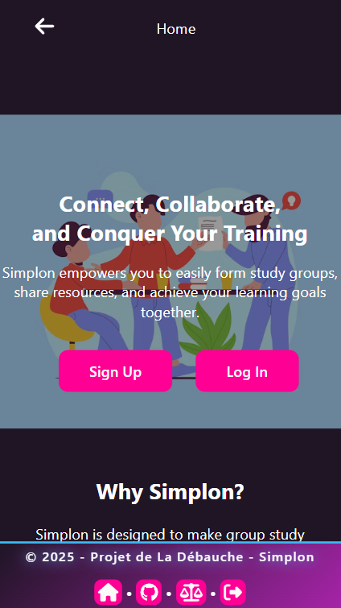

# :busts_in_silhouette: Groups-Front

Une application Angular (v3) pour la création et la gestion de groupes d'utilisateurs, avec des fonctionnalités de génération automatique basée sur des critères spécifiques.

Projet développé par [Quentin Zampieri](https://github.com/Quentin384), [Ennio PILIA](https://github.com/EnnioPilia), [Laurent Lefebvre--Ossola
](https://github.com/Raidel-28) & [Christopher PEREZ](https://github.com/Chr1stopherPerez), en réponse à un brief proposé durant notre formation à [SIMPLON](https://www.simplon.co/).
 Cette version 3 du projet intègre des fonctionnalités avancées de gestion de groupes et une interface utilisateur améliorée.

---

## Contexte & Objectif

L'application "Groups-Front" est conçue pour faciliter la création et la gestion de groupes d'utilisateurs. Elle permet de :

- Créer et gérer des groupes d'utilisateurs
- Générer automatiquement des groupes selon différents critères
- Visualiser les détails des groupes
- Gérer les membres des groupes
- Authentifier les utilisateurs avec vérification d'email

## Fonctionnalités

- **Gestion des Groupes** : création, consultation, modification, suppression
- **Génération Automatique** : création de groupes basée sur des critères comme le mélange d'anciens DWWM et le mélange des âges
- **Gestion des Membres** : ajout, suppression, visualisation des membres d'un groupe
- **Authentification** : inscription, connexion, vérification d'email
- **Tableau de Bord Admin** : fonctionnalités spécifiques pour les administrateurs
- **Interface Responsive** : compatible avec différents appareils

## Structure du projet

```
groups-front/
├── src/
│   ├── app/
│   │   ├── pages/                  # Composants de pages
│   │   │   ├── admin-dashboard/    # Tableau de bord administrateur
│   │   │   ├── error/              # Page d'erreur 404
│   │   │   ├── generate-groups/    # Génération de groupes
│   │   │   ├── groupes/            # Gestion des groupes
│   │   │   ├── home/               # Page d'accueil
│   │   │   ├── list/               # Liste des éléments
│   │   │   ├── listDetails/        # Détails de liste
│   │   │   ├── login/              # Connexion
│   │   │   ├── members/            # Gestion des membres
│   │   │   ├── register/           # Inscription
│   │   │   └── verify-email/       # Vérification d'email
│   │   ├── shared/                 # Composants partagés
│   │   │   └── components/         # Composants réutilisables
│   │   ├── app.component.ts        # Composant racine
│   │   ├── app.routes.ts           # Configuration des routes
│   │   └── app.config.ts           # Configuration de l'application
│   ├── assets/                     # Ressources statiques
│   └── environments/               # Configurations d'environnement
├── docs/                           # Documentation
│   └── specifications/             # Spécifications du projet
├── README.md                       # Documentation utilisateur
└── angular.json                    # Configuration Angular
```

## Prérequis

- **Node.js** (version 16 ou supérieure)
- **npm** (généralement installé avec Node.js)
- **Angular CLI** (version 19.2.9)

## Installation & Exécution

1. **Cloner le projet**
   ```bash
   git clone https://github.com/Quentin384/Groups-Front.git
   cd Groups-Front
   ```

2. **Installer les dépendances**
   ```bash
   npm install
   ```

3. **Lancer le serveur de développement**
   ```bash
   ng serve
   ```

4. **Accéder à l'application**
   Ouvrez votre navigateur et accédez à `http://localhost:4200/`

## Compilation pour la production

Pour compiler l'application pour la production :

```bash
ng build --prod
```

Les fichiers compilés seront stockés dans le répertoire `dist/`.

## Scénario d'utilisation rapide

1. **S'inscrire ou se connecter** via les pages d'inscription ou de connexion
2. **Accéder à la page de génération de groupes**
3. **Définir les critères** de génération (nombre de groupes, mélange d'anciens DWWM, mélange des âges)
4. **Générer les groupes** en cliquant sur le bouton de génération
5. **Visualiser les groupes générés** dans la section des groupes
6. **Consulter les détails** d'un groupe spécifique

## Captures d'écran


